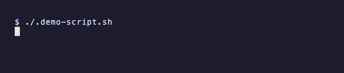

# Pipewright

CLI-first, model-agnostic, plugin-based AI dev workflow automation. Chain AI agents into
multi-step pipelines where each step is focused, checkpointed, and cost-optimized.

Works with **5 LLM providers** -- from free models to Claude Opus.



## Install

```bash
pip install pipewright                # Anthropic (default provider)
pip install pipewright[openai]        # + OpenAI, Groq, OpenRouter, Ollama
```

Or from source:

```bash
git clone https://github.com/brangi/pipewright.git
cd pipewright
pip install -e ".[dev,openai]"
```

Requires Python 3.11+. Then run setup to configure your provider and API key:

```bash
pipewright setup
```

This walks you through picking a provider (including free ones like Groq and
OpenRouter), pasting your API key, and saving it to `~/.pipewright/.env`.

## Quick Start

```bash
pip install pipewright[openai]        # install with all providers
pipewright setup                      # pick a provider, paste your key
pipewright run test-gen ./src/auth.py -y   # generate tests
```

## Usage

Generate tests for a source file:

```bash
pipewright run test-gen ./src/auth.py
```

Solve a GitHub issue end-to-end (analyze, plan, implement, open PR):

```bash
pipewright run issue-solve 42
```

Review code changes:

```bash
pipewright run code-review HEAD~1..HEAD
pipewright run code-review "#2"
```

Debug an issue systematically:

```bash
pipewright run debug "TypeError in auth.py line 42"
```

Refactor code:

```bash
pipewright run refactor ./src/auth.py
```

Generate documentation:

```bash
pipewright run docs-gen ./src/
```

List all available workflows:

```bash
pipewright list
```

Auto-approve checkpoints for CI/scripted use:

```bash
pipewright run test-gen ./src/auth.py -y
```

Export results as JSON:

```bash
pipewright run test-gen ./src/auth.py --format json
pipewright run test-gen ./src/auth.py -o result.json -y
```

Resume an interrupted workflow:

```bash
pipewright resume                       # list resumable sessions
pipewright resume <session-id>          # pick up where you left off
```

## Providers

Pipewright supports multiple LLM providers. Use the `--provider` / `-p` flag to
switch providers, or set a default in config.

```bash
# Use any provider
pipewright run test-gen ./src/auth.py                    # Anthropic (default)
pipewright run test-gen ./src/auth.py -p openai          # OpenAI
pipewright run test-gen ./src/auth.py -p groq            # Groq (free)
pipewright run test-gen ./src/auth.py -p openrouter      # OpenRouter (free)
pipewright run test-gen ./src/auth.py -p ollama          # Ollama (local, free)

# List available providers
pipewright providers

# Set default provider
pipewright config set provider groq
```

### Provider Comparison

| Provider | Cost | Models | Setup |
|----------|------|--------|-------|
| **Anthropic** | Paid | Claude Haiku, Sonnet, Opus | `ANTHROPIC_API_KEY` |
| **OpenAI** | Paid (~$0.003/run) | GPT-4o-mini, GPT-4o | `OPENAI_API_KEY` + `pip install pipewright[openai]` |
| **Groq** | Free tier | Qwen3 32B | `GROQ_API_KEY` + `pip install pipewright[openai]` |
| **OpenRouter** | Free models | StepFun Step 3.5 Flash, Nemotron 120B | `OPENROUTER_API_KEY` + `pip install pipewright[openai]` |
| **Ollama** | Free (local) | Llama, Mistral, CodeLlama, etc. | `pip install pipewright[openai]` + Ollama running |

### Model Aliases

Plugins use model aliases (`haiku`, `sonnet`, `opus`) that map to the appropriate
model for each provider:

| Alias | Anthropic | OpenAI | Groq | OpenRouter | Ollama |
|-------|-----------|--------|------|------------|--------|
| haiku | claude-haiku-4-5 | gpt-4o-mini | qwen3-32b | step-3.5-flash:free | llama3.2:3b |
| sonnet | claude-sonnet-4-5 | gpt-4o | qwen3-32b | nemotron-3-super-120b-a12b:free | llama3.3:70b |
| opus | claude-opus-4-6 | gpt-4o | llama-3.3-70b | llama-3.3-70b-instruct:free | llama3.3:70b |

This means plugins are **fully provider-agnostic** -- the same workflow runs
on any provider without changes.

### How It Works

- **Anthropic** uses the Claude Agent SDK natively with MCP memory tools and
  SDK hooks. This is the most capable path.
- **All other providers** use the OpenAI-compatible chat completions API with
  pipewright's own agent loop. Tools (Read, Write, Edit, Glob, Grep, Bash) run
  locally. Memory tools work via function calling instead of MCP.

## Supported Languages

Pipewright works with any programming language. The AI agents read, analyze,
and generate code using standard dev tools. These languages have dedicated
examples and test framework detection:

| Language   | Extensions     | Default Test Framework | Example                    |
|------------|----------------|------------------------|----------------------------|
| Python     | .py            | pytest                 | `example/python/utils.py`  |
| JavaScript | .js            | Jest                   | `example/js/utils.js`      |
| TypeScript | .ts, .tsx      | Vitest                 | `example/ts/utils.ts`      |
| Java       | .java          | JUnit 5                | `example/java/Utils.java`  |
| Rust       | .rs            | cargo test             | `example/rust/src/lib.rs`  |
| Go         | .go            | go test                | `example/go/utils.go`      |
| Ruby       | .rb            | RSpec                  | `example/ruby/utils.rb`    |

Generate tests for any language:

```bash
pipewright run test-gen ./src/utils.js       # JavaScript -> Jest
pipewright run test-gen ./src/lib.rs         # Rust -> cargo test
pipewright run test-gen ./cmd/server.go      # Go -> go test
```

## Create a Plugin

Scaffold a new plugin:

```bash
pipewright init my-plugin
```

Or manually -- create `plugins/my_plugin/workflow.py`:

```python
from pipewright.workflow import Workflow, Step

class MyPluginWorkflow(Workflow):
    name = "my-plugin"
    description = "Does something useful"
    steps = [
        Step(name="analyze", prompt="Analyze {target}.\n\n{context}",
             tools=["Read", "Glob"], model="haiku"),
        Step(name="execute", prompt="Execute on {target}.\n\n{context}",
             tools=["Read", "Write"], model="sonnet", checkpoint=True),
    ]
```

Run `pipewright list` to verify it appears. Plugins work with all providers
automatically -- no provider-specific code needed.

## Architecture

```
CLI (Click)
  |
  v
Plugin Loader ---- plugins/*/workflow.py
  |
  v
Engine (async orchestrator)
  |
  v
Provider Layer
  ├── AnthropicProvider  (Claude Agent SDK + MCP memory)
  └── OpenAICompatProvider (openai SDK + local tools)
        ├── OpenAI      (gpt-4o-mini, gpt-4o)
        ├── Groq        (Qwen3 32B — free)
        ├── OpenRouter   (free model router)
        └── Ollama       (local models — free)
```

Plugins define steps with prompt templates and tool lists. The engine resolves
the provider, maps model aliases, and executes each step. Smart context
compaction extracts key information (file paths, headers, decisions, errors)
between steps instead of raw truncation. Checkpoints pause for human review.
Workflow hooks (`on_start`, `on_step_complete`, `on_complete`) enable custom
logic at each lifecycle stage. Sessions persist to disk, enabling resume after
interruption.

## Project Structure

```
src/pipewright/
  cli.py              CLI entry point (Click)
  engine.py           Async orchestrator
  workflow.py         Step, Chain, Workflow, HookContext dataclasses
  config.py           JSON config (~/.pipewright/config.json)
  context.py          Smart context compaction between steps
  session.py          Session persistence and resume
  plugins/loader.py   Plugin discovery
  providers/          Provider abstraction layer
    base.py           Provider ABC
    registry.py       Provider registration and lookup
    anthropic.py      Claude Agent SDK wrapper
    openai_compat.py  OpenAI-compatible provider (+ Groq, OpenRouter, Ollama)
    tools.py          Local tool implementations for non-Claude providers
    types.py          Shared types (ProviderStepResult, StepResult, WorkflowResult)
  memory/             Persistent memory (JSON + MCP server)
  observability/      Terminal display and SDK hooks

plugins/
  test_gen/           Generate test suites
  issue_solve/        Solve GitHub issues end-to-end
  code_review/        Review code changes
  refactor/           Refactor code
  docs_gen/           Generate documentation
  debug/              Systematic debugging
```

## Configuration

Run `pipewright setup` to configure your provider and API key interactively.

For advanced usage:

```bash
pipewright config set provider groq           # default provider
pipewright config set model sonnet            # default model alias
pipewright config set max_budget_usd 1.00     # budget cap per step
pipewright config get provider
```

Settings stored in `~/.pipewright/config.json`. API keys are stored in
`~/.pipewright/.env` (set by `pipewright setup`), or you can use a `.env`
file in your project root to override.

## CI/CD

Generate a GitHub Actions workflow:

```bash
pipewright ci-setup
```

This creates `.github/workflows/pipewright.yml` and tells you which GitHub
Secret to add (Settings -> Secrets -> Actions).

Or configure manually -- pipewright works with any CI that sets environment
variables:

```yaml
- name: Run pipewright
  env:
    GROQ_API_KEY: ${{ secrets.GROQ_API_KEY }}
  run: pip install pipewright[openai] && pipewright run test-gen . -p groq -y
```

## Contributing

See [CONTRIBUTING.md](CONTRIBUTING.md) for development setup, coding guidelines,
and how to add plugins. For the full plugin authoring reference, see
[docs/PLUGIN_GUIDE.md](docs/PLUGIN_GUIDE.md).

## Roadmap

See [ROADMAP.md](ROADMAP.md) for planned features and milestones.

## License

MIT -- see [LICENSE](LICENSE).
